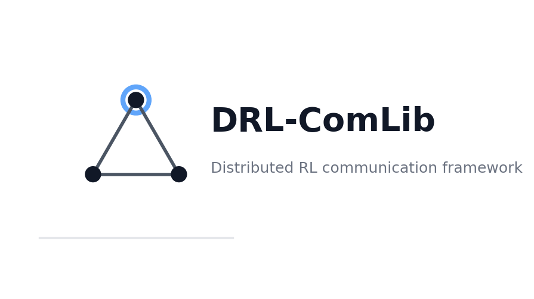

<p align="center">
  
</p>

# DRL-ComLib

# DRL-ComLib

A communication-focused framework for distributed reinforcement learning across processes, networks, and devices, built around a lightweight distributed PPO example using ZeroMQ sockets and actor-learner coordination.

The main contribution of this repository is the communication framework in `framework/`, which handles actor-learner synchronisation, rollout transport, weight broadcasts, staleness-aware batch handling, resets, and shutdown signaling. The PPO training loop and model structure are intentionally compact and are based on the CleanRL style of single-file PPO implementations rather than being the primary contribution.
## Focus

This repository should be read primarily as a systems project for distributed RL communication, with a focus on how this communication can improve learning under real world constraints. The learner and actor scripts exist to exercise and evaluate the communication stack under buffering, stale rollout handling, reset policies, and outage scenarios.

The core logic lives in `framework/`, while the top-level PPO files provide a concrete end-to-end workload for testing the transport and control-plane design.

## Architecture

The runtime follows a standard actor-learner split. Actors instantiate an actor-only policy, request initial weights from the learner, collect rollouts, and send them back through ZeroMQ. The learner owns the full actor-critic model, waits for all actors to register, receives and merges rollout batches, computes advantages and optional experience weights, performs PPO updates, and broadcasts new actor weights back to the actors.

Communication is split across multiple ZeroMQ patterns: PUSH/PULL for rollout upload, PUB/SUB for weight and control broadcasts, and REQ/REP for the initial synchronisation handshake. This separation keeps the control plane explicit and makes it easier to test batching, delayed actors, resets, and network-outage behaviour independently of the PPO update logic.

## Main components

| Component | Role |
|---|---|
| `framework/comms.py` | Transport layer for actor-learner communication, including weight sync, rollout transfer, control messages, buffering, and reset/shutdown behavior. |
| `framework/protocol.py` | Shared data contract for rollout batches and related metadata used across collection, communication, and training. |
| `ppo_actor.py` | Actor process entrypoint that runs environment interaction and participates in communication with the learner. |
| `ppo_learner.py` | Learner process entrypoint that receives batches, optimises the policy, and broadcasts updated weights. |
| `rollout.py` | Rollout collection logic and episodic-stat extraction. |
| `training.py` | Advantage computation, weighting strategies, and PPO optimisation steps. |
| `models.py` | Actor, critic, and learner-side `Agent` definitions. |
| `logging_utils.py` | TensorBoard logging helpers for training, infrastructure, comms, resets, and diagnostics. |
| `args.py` | Centralised configuration for PPO, communication, staleness, reset, and runtime-derived values. |

## PPO baseline

The PPO portion of the repository follows the compact, readable style popularized by CleanRL. CleanRL is available at [github.com/vwxyzjn/cleanrl](https://github.com/vwxyzjn/cleanrl).

In this repository, PPO is mainly the experimental workload used to validate the communication framework under realistic distributed training conditions. The interesting systems behaviour comes from batching, staleness thresholds, partial flushes, actor cacheing, reset policies, and coordination semantics.

## Features

- Distributed actor-learner execution with separate process entrypoints.
- ZeroMQ-based transport for data-plane and control-plane messaging.
- Configurable learner buffering and per-actor pending-batch caps.
- Rollout staleness tracking and rejection via `staleness_threshold`.
- Learner-triggered targeted actor resets after repeated stale batches.
- Optional experience weighting strategies: `uniform`, `latency`, and `is` (importance sampling).
- TensorBoard diagnostics for training, throughput, rollout metadata, resets, and weights.
- Actor-side outage simulation for resilience experiments.

## Installation

A minimal setup path (based on uv) is:

```bash
uv sync
```

## Running

Start the learner first:

```bash
python ppo_learner.py --env-id CartPole-v1 --num-actors 2
```

Then launch one actor process per actor id:

```bash
python ppo_actor.py --actor-id 0 --env-id CartPole-v1 --num-actors 2
python ppo_actor.py --actor-id 1 --env-id CartPole-v1 --num-actors 2
```

The learner waits for actor handshake completion before broadcasting the initial policy, and the actors then collect rollouts, send batches, and continue polling for weight updates, resets, and shutdown messages during training.

## Monitoring

The learner creates TensorBoard logs under `runs/<run_name>` and records hyperparameters, losses, episodic statistics, learning rate, SPS, communication latency, learner-step gap, reset counts, and weighting diagnostics. To inspect training:

```bash
tensorboard --logdir runs
```